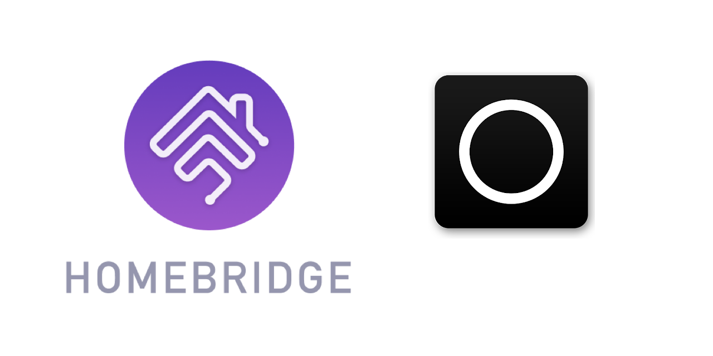

<p align="center">
    
</p>
<span align="center">

# Homebridge NB
[](https://www.npmjs.com/package/homebridge-nb)
[](https://www.npmjs.com/package/homebridge-nb)
[](https://discord.gg/yGvADWt)
[](https://github.com/homebridge/homebridge/wiki/Verified-Plugins)

[](https://github.com/ebaauw/homebridge-nb/issues)
[](https://github.com/ebaauw/homebridge-nb/pulls)
[](https://standardjs.com)

</span>

## Homebridge plugin for Nuki Bridge
Copyright © 2020 Erik Baauw. All rights reserved.

This [Homebridge](https://github.com/homebridge/homebridge) plugin exposes
[Nuki Smart Lock](https://nuki.io/nl/smart-lock/) and
[Nuki Opener](https://nuki.io/nl/opener/) devices,
connected to a [Nuki Bridge](https://nuki.io/nl/bridge/),
to Apple's [HomeKit](https://www.apple.com/ios/home/).
It provides the following features:
- Expose each Nuki Bridge as separate accessory with a custom service.
Home shows this accessory as _Not Supported_ in Home, but is required for
Homebridge NB.
In Eve and other HomeKit apps, this accessory provides control of the polling
rate, the level of logging, and rebooting the Bridge.<br>
In future, this accessory might become a separate bridge.
- Expose each Nuki Smart Lock as a separate accessory, with a _Lock Mechanism_
service to control the lock, and a _Battery_ service for the battery.
The when present and configured, door sensor is exposed as separate
_Contact Sensor_ service, including Eve history.
- Expose each Nuki Opener as separate accessory, with a _Doorbell_ service for
the ringer, a _Lock Mechanism_ service for the opener, and a _Battery_ Service
for the battery.
- Zero configuration:
  - Automatic discovery of Nuki Bridge and paired Smart Lock and Opener devices.
  - Automatic configuration of API token.
The token is persisted across Homebridge restarts (in the Bridge accessory).
- Technical:
  - Use local API provided by the Nuki Bridge; no Internet connection needed
(except for discovery of the Bridge).
  - Use hashed tokens for added security.
  - Subscribe to Nuki Bridge for notifications on device state changes.
  - Use _Identify_ on the Smart Lock and Opener accessories to force the Bridge
to contact the device and refresh the cached device state.

### Work in Progress
Note that this plugin is still under development.

### Prerequisites
Homebridge NB communicates with the Nuki Bridge using the local
[Nuki Bridge HTTP API](https://developer.nuki.io/page/nuki-bridge-http-api-1-12/4).
You need to enable this API through the Nuki app.

Use [Eve](https://www.evehome.com/en/eve-app) to get the full functionality,
like history for the door sensor,
and support for _Ring to Open_ and _Continuous Mode_ on the Opener.

### Command-Line Tool
Homebridge NB includes a command-line tool, `nb`,
to interact with the Nuki Bridge from the comand line.
It takes a `-h` or `--help` argument to provide a brief overview of
its functionality and command-line arguments.

### Installation
To install Homebridge NB:
- Follow the instructions on the [Homebridge Wiki](https://github.com/homebridge/homebridge/wiki) to install Node.js and Homebridge;
- Install the Homebridge NB plugin through Homebridge Config UI X or manually by:
  ```
  $ sudo npm -g i homebridge-nb
  ```
- Edit `config.json` and add the `NB` platform provided by Homebridge NB, see [**Homebridge Configuration**](#homebridge-configuration);
- Run Homebrdige NB for the first time, and press the button on the Nuki bridge.
The bridge should be discovered automatically.
Pressing the button allows Homebridge NB to obtain a token (API key).

### Configuration
In Homebridge's `config.json` you need to specify Homebridge NB as a platform
plugin.

```json
  "platforms": [
    {
      "platform": "NB"
    }
  ]
```
